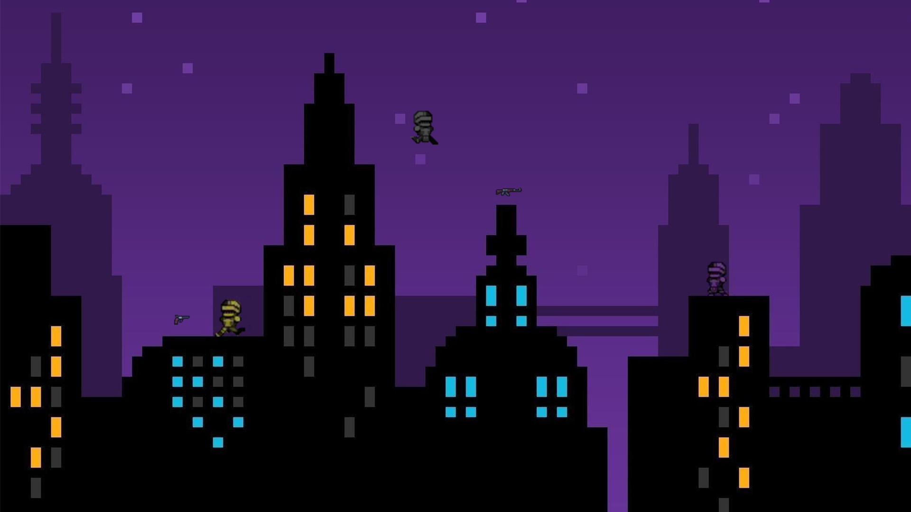
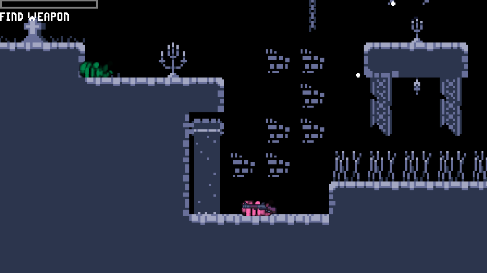
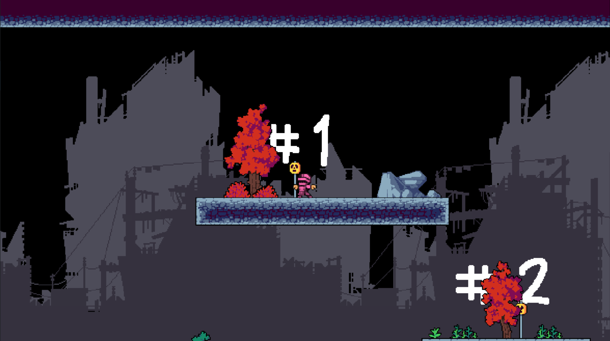
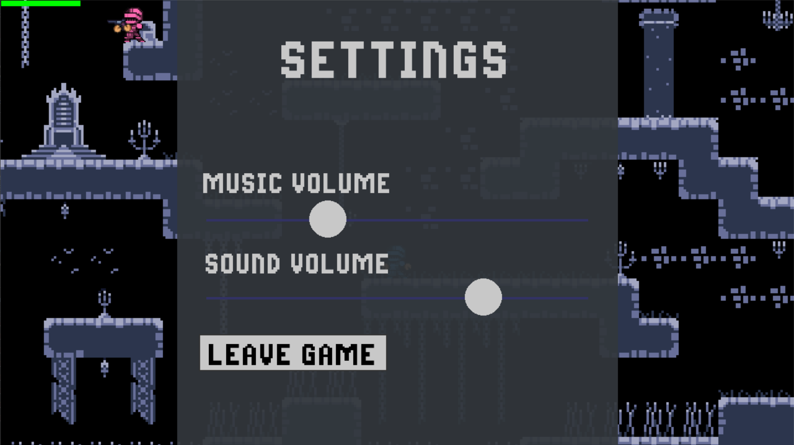

# Knight game

### Gameplay trailer

[](https://www.youtube.com/watch?v=dQw4w9WgXcQ)

### In-game screenshots:

<div style="text-align: center;">
    
    
    
</div>

### Project Description

Enter the futuristic year of 1584, an age where knights find modern guns and run wild in a frantic battle for glory. Win
over the crowd and
gain a following by blasting your armored friends with Shotguns, Rifles and Pistols. Few hits and you're DEAD. This
is KNIGHT GAME. Don't blink.

- 2 to 4 PLAYERS in either Local Multiplayer, or Online Play!
Easy to pick up, emphasizing strategy over twitch reaction
- 4 Levels + Ability to create your own, 3 Weapons
- Exciting gameplay

### Controls:

---

| Buttons | Action | | Buttons                     | Action                  |
| --- | --- | --- |-----------------------------|-------------------------|
| `A` | move left | | `J`                         | pick up / drop a weapon |
| `D` | move right | | `Enter`                     | shoot                   |
| `Space`                     | jump | | `Show hands to your webcam` | reload weapon           |
| `Esc` | open the game menu during a match | |

### How to play:

To download our project you should git clone it from this address:

```
https://github.com/timurio111/knight-game.git
```

To run ***.py files you have to install all dependencies listed in requirements.txt by writing

```sh
pip install -r requirements.txt
```

to the terminal

So, if you are fine with previous steps, then you are almost up to play!
Now you have to start main.py

And one of you has to run server in the local network

The last step you have to do is set up your webcam right in front of your face and make sure both of your palms
fit into the frame.

Have fun!

---

> [@timurio111](https://github.com/timurio111) &nbsp;&middot;&nbsp;
> [@ShayahmetovAskar](https://github.com/ShayahmetovAskar) &nbsp;&middot;&nbsp;
> [@MeganJard](https://github.com/MeganJard) &nbsp;&middot;&nbsp;
> [@SkylineUwU](https://github.com/SkylineUwU)